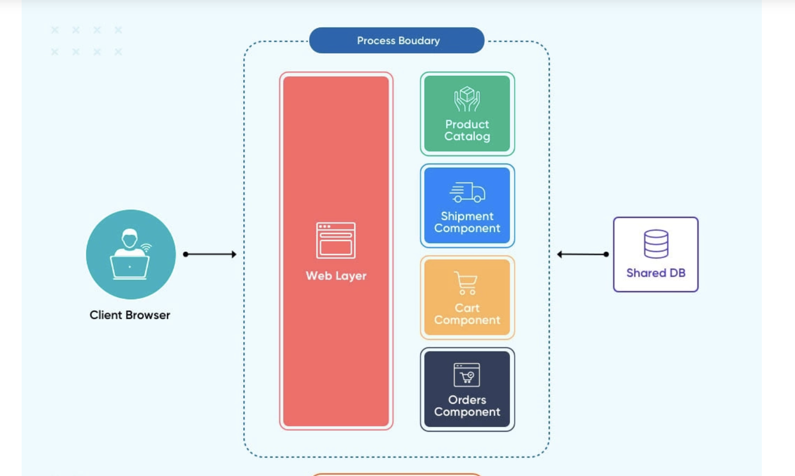
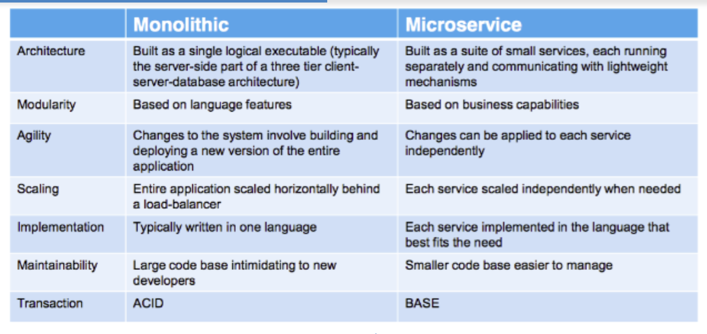

- *what is a Microservice?*

   - MicroService have own container like uI, backend, database, sms etc
   - every app function is its own service
   - communicate via APIs
   - having different port 
  - seperation of concern or single responsablity

     

   - Advantage:
       - different container use different lanuage
       - less risk in change 
       - independing scaling
       - we can deploy indepedent service
       - it rate at will devolps pipeline

- _what is Monolith architecture?_

    

    - service- side system Based on single application
    - Easy develop,deploy and manage

    - Challenage
       - Highly dependend
       - language/ framework strike
       - hero deployment
       - scaling is diffcult if it grow

- *what is the difference between monolith and microservice?*


- *why do we need a useEffect Hook?*
  
  - syntex :- useEffect(setup, dependencies?)
  useEffect(//setup function ()=>{
  
   // optionally return a cleanup function
    return () => {....}

  }, [dependencies])

   - After adding component to dom it run callback function/ setup function of useEffect(setup, dependencies?)
   - after every re-render with changed dependencies
   - React will first run the cleanup function (if you provided it) with the old values, and then run your setup function with the new values.
   - After your component is removed from the DOM, React will run your cleanup function.
   - useEffect returns undefined.


- *what is Optional Chaining?*

  - The optional chaining (?.) operator accesses an object's property(a safe way to access nested object properties) or calls a function.
  - very simple to use. The ?. checks the left part for null/undefined and allows the evaluation to proceed if it’s not so.

  - obj?.prop – returns obj.prop if obj exists, otherwise 
  undefined.

       ```
          let user1 = {
          firstName: "virat",
          lastName: null,
          };
        console.log(user1?.firstName) // virat
        console.log(user1?.lastName) // undefined
        console.log(user1?.address?.street) // undefined
          ```
        
  - obj?.[prop] – returns obj[prop] if obj exists, otherwise undefined.

          ```
          let user1 = {
          firstName: "virat"
          lastName: null,
          };
        console.log(user1?.["firstName"]) // virat
        console.log(user1?.["lastName"]) // undefined
        console.log(user1?.["address"]?.["street"]) // undefined
          ```
  - obj.method?.() – calls obj.method() if obj.method exists, otherwise returns undefined

    ```
    let cricket = {
      virat() {
        alert("I am fan");
      }
    };

    let withOutVirat = {};

    userAdmin.virat?.(); // I am fan

    withOutVirat.irat?.(); // nothing happens (no such method)

    ```

- *what is shimmer UI?*

  - A shimmer UI is a version of the UI refered as animated effect used to indicate loading or activity not actual data  just mimic layout and shape of content that will eventually appear.

- *what is the difference between JS expression and JS statement*

https://ishiimwe.hashnode.dev/statements-vs-expressions-in-javascript

- *what is Conditional Rendering, explain with a code example?*

   - Conditional Rendering is way to display different component in dom depend upon condition 
   
   - you can conditionally render JSX using JavaScript syntax like if statements, &&, and ? : operators

   - here we see three different way to use conditional rendering 

   - making a Heading component which has his own local state varible which use to login and we take default value is false if user login it turn tha state varible to true and here we how conditional rensering if it true than it exeute 
  " Hi I login" else "Hi I not login"

  - you can use conditional rendering with JSX by using JavaScript expressions inside curly braces {} to conditionally render components. 

   <mark>using If/else statements</mark>

        ```
        function Heading(){
        const [logIn, setLogIn] = useState(true)
    
        if(!logIn){
                return(
                <div>
                    <h1>Hi I login</h1>
                </div>
                )
            }
            else{

                return(
                    <div>
                    <h1>Hi I not login</h1>
                    </div>
                )
            }

            
        }
        ```
  <mark>using Ternary operator</mark>

        ```
        function Heading1() {
        const [logIn, setLogIn] = useState(true);
      
        return (
          <div>
            {logIn ? (
              <h1>Hi, I'm logged in</h1>
            ) : (
              <h1>Hi, I'm not logged in</h1>
            )}
          </div>
        );
      }

        ```
  <mark>The logical && operator for conditional rendering like this:</mark>

        ```
        function Heading2() {
        const [logIn, setLogIn] = useState(true);
      
        return (
          <div>
            {logIn && <h1>Hi, I'm logged in</h1>}
            {!logIn && <h1>Hi, I'm not logged in</h1>}
          </div>
        );
  }
        ```

- *what is CORS?*

    - cors stands for cross origin resourse sharing
    - cors is mechanisum  which uses additional information  in header to tell the browser whether the specific web app can share resouces with another app
    - same origin  then they share resource easily

    - [cors]("https://aws.amazon.com/what-is/cross-origin-resource-sharing/")


- *what is async and await?*

   - async and await combo are used to handle promise

   - async is keyword before function and always return promise and  and await always used inside async function

    - async function => return promise it ok it not wrap in promise
    - async function => return value than it wrap into promise

   - async tell its asynchronous function and await mean wait for data fetch

   ```
     const header = async ()=> 
      (
        const data = await fetch("");
        const json =  await data.json();
        console.log(json)

      )
     
   ```

- *what is the use of `const json = await data.json();` in getRestaurants()*

- when we fetch() we return promise and that respone is raw data which is readable using json method we converted raw data to json 

 