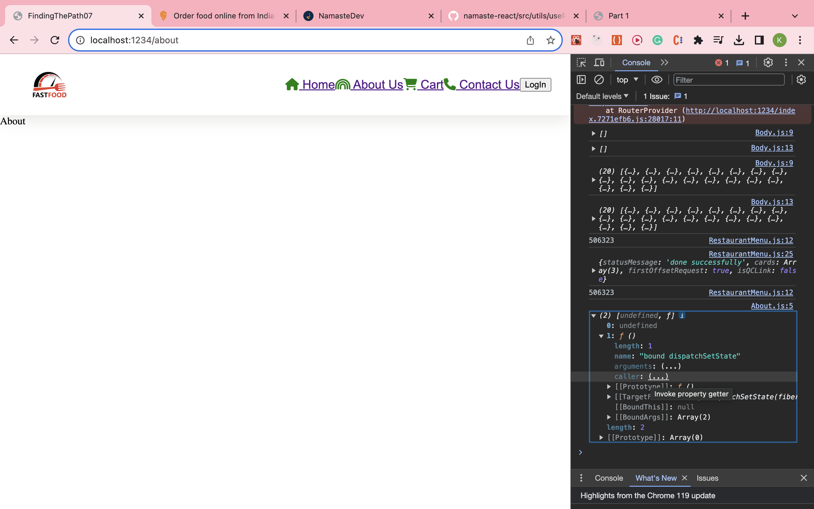

- **what are various ways to add images into our App? Explain with code examples?**

    - we can create local folder name- assets and from there we use this images in our code.

    - other way is cdn way images store in server(which we used in swiggi api for images)
          
            - cdn is faster
            - if caches the images return very fast
            - have 100% uptime
            - optimizing thing

- **What would happen if we do console.log(useState())?**

   - it just return the [local state varible , function to upadate local state varble] when we console useState();
   - 

- **How will useEffect behave if we don't add a dependency array?**

    
    ### change the behaviour of render

    - if no dependency array => useEffect is called on every render

    - if dependency  array is empty = []=> useEffect is called on inital render(just once)

    - if dependency array is[some_thing in dependency arry mean any local varible] called every time when some_thing(useState varible) is updated

- **What is SPA?**

   - *single page application* it not change the network call and fetch the data it only change component which are already there when code mean it used client side routing(we don't need to do refresh/reload the page)

- **What is difference between client side Routing and server side routing?**

    - we used to do network call and get html,css and javascript and load the whole page it called (*server side routing 
    *)

    - we don't do network call and get html,css and javascript  we only just change the component(everthing there in code) *server side routing*

<mark>Resources</mark>

[React Router DOM](https://reactrouter.com/en/main)

[Client Side Routing](https://reactrouter.com/en/main/start/overview)

[Formik](https://formik.org)
