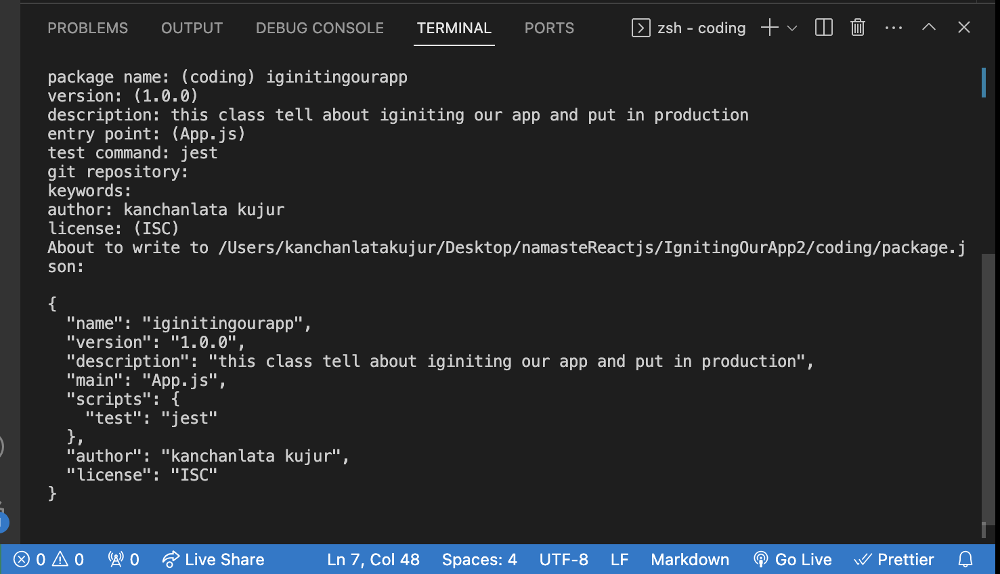
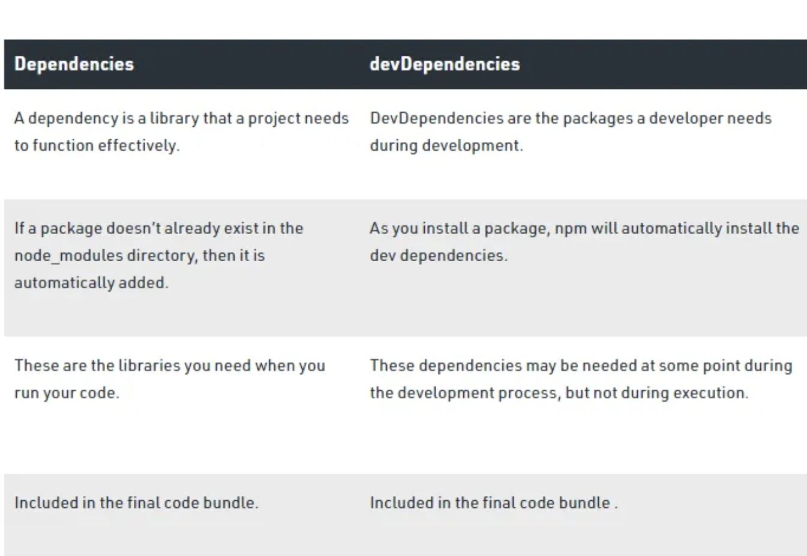
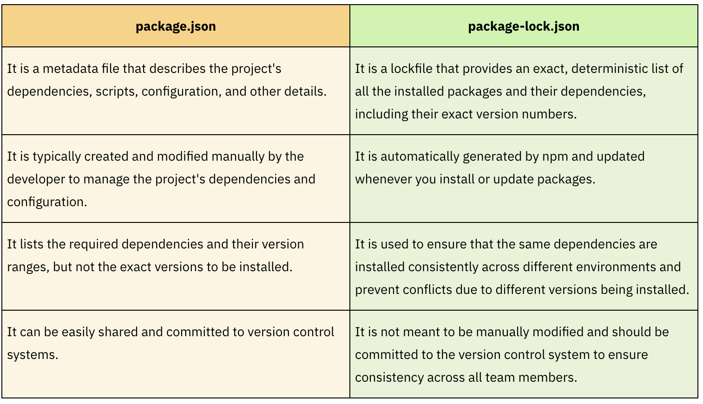
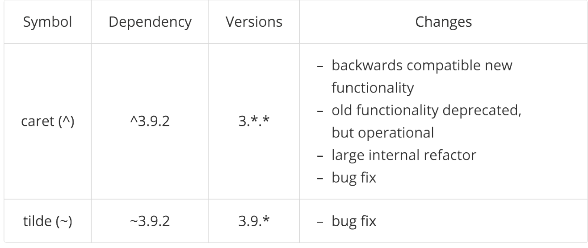

### 1. what is NPM?

- *it is manager which mange the package in our project and it not stand for node package manger*

- how we install npm in project
      - npm init 
     
- npm init -y( hwere we skip some options)

      - it outcome of this command is json file called package.json

### 2. what is parcel/webpack? why do we need it?

- they all are bundler(parcel, webpack, vite) which bid the  code and ship to production.
          OR
-  A bundler is a tool that takes all your JavaScript code, along with any other assets like CSS or images, and combines them into a single file (or a few files) that can be served to the browser

- create react app use webpack

- all work same it depend upon what u like.

#### parcel(why do we need it?)

   - Dev Build
   - Local server
   - HMR - hot Module replacemen
   - File Watching Algorithm - writtten in C++
   - caching - faster Builds
   - Image Optimization
   - Minification
   - Bundling
   - Compress
   - Consistent Hasshing
   - code Splitting
   - Differential bundling - support older browser
   - Diagnostic
   - Error Handling
   - Https
   - tree shaking -remove unused code
   - different dev and production bundles

### what is parcel-cache?
- *parcel make space for .parcel-cache where we do transformation, dependency resolution, bundling, optimizing, tracking( File Watching Algorithm - writtten in C++) and everything in between*

- *it increase the speed of development if a change happend it dont rebuild everthing it only change where it need and it instant reflected  by dev sever thanks to cache data store in parcel-cache.*

- *By tracking changes and only rebuilding what's necessary, Parcel optimizes resource utilization. This leads to faster development server restarts and more efficient use of system resources.*

-  *Parcel's ability to track dependencies ensures that it always uses the latest versions and configurations, which can help prevent issues related to outdated or stale data.*

### what is npx?
 - *NPX stands for Node Package eXecute. It is simply an NPM package runner.*
 - *Example:- npx parcel index.html(Here index.html is source file )*

### what is difference between dependencies vs devDependencies?

- 

### what is Tree Shaking?
- Tree shaking is essential for optimizing the size of JavaScript bundles, especially in larger applications where you may have numerous libraries and dependencies. By removing dead code, you can significantly reduce the size of the output bundle, resulting in faster loading times for your web applications.

- Module System: In modern JavaScript development, code is often organized into modules, and dependencies between these modules are managed through import and export statements.

- Static Analysis: Tree shaking relies on static code analysis, which means that it examines the code at compile time without executing it. It looks at the module dependencies in your code and identifies which parts of the code are reachable and which are not.

- Dead Code Removal: Once the bundler/compiler identifies that a particular module or function is not used anywhere in the application, it can safely remove it from the final bundle. This is particularly useful for eliminating unnecessary code, which can reduce the bundle size and improve the application's load time and performance.

### what is Hot Module Replacement?
- *HMR is a more advanced technique that allows you to update individual modules in the browser at runtime without requiring a full page refresh. This feature significantly improves the development experience by preserving application state and avoiding the need to manually refresh the entire page when making small code changes
- *HMR is particularly valuable for developers working on complex applications, as it reduces the interruption caused by page refreshes and helps maintain the state of the application as you make code modifications. It makes the development process more seamless and efficient.*

### List down your 5 superpower of parcel and describe any 3 of them in your own words
- *1.Local server:- it provide as local server(http://localhost:1234.) default one  and it better than url*

- *2.HTTPS:-  Parcel’s dev server supports HTTPS. *
- *3.Diagnostics:- it provide colorfull diaplay diagnostics in termial or browser if we get error in code or configration it also provide hind for solving error. Many diagnostics even include a documentation link where you can learn more.*

- *4.Code Splitting:- With Parcel, you don't need to set up complex configuration files to enable code splitting. It's enabled by default, which means that as you build your application, Parcel automatically identifies the appropriate points in your code for splitting.*

  - Code splitting in Parcel is typically controlled using the dynamic import() syntax. When you use import() in your code, it returns a Promise, and the module specified in the import statement is loaded asynchronously when needed.

- *5. Minification :- Parcel includes minifiers for JavaScript, CSS, HTML, and SVG . Minification reduces the file size of your output bundles by removing whitespace, renaming variables to shorter names, and many other optimizations.
 - By default, minification is enabled when using the parcel build command.*

### what is .gitignore? what should we should we add not add into it?

- *A .gitignore file is a plain text file that contains a list of all the specified files and folders from the project that Git should ignore and not track.*

- * we add some file which recreated at production phase so we should ignore*

-*what should we should we add not add into it*

- *node_modules folder we add into .gitignore file (heaveys object in univese) it regenerted in production phase* 

- *.env files contain API keys that need to remain secure and private our credentials (username and password)*

- *log files.hey provide information on the Operating System’s usage activities and errors, as well as a history of events that have taken place within the OS.*

- *Operating System files. Each Operating System (such as macOS, Windows, and Linux) generates system-specific hidden files that other developers don’t need to use since their system also generates them. For example, on macOS, Finder generates a .DS_Store file that includes user preferences for the appearance and display of folders, such as the size and position of icons.*

(read article about .gitignore file)[https://www.freecodecamp.org/news/gitignore-file-how-to-ignore-files-and-folders-in-git/]

### what is difference between package.json and package-lock.json?

- (read article for package-lock.json)[https://www.atatus.com/blog/package-json-vs-package-lock-json/#:~:text=json%20file%20is%20like%20a,sub%2Ddependencies%20and%20their%20versions.]

### why should i not modify package-lock.json?

- *Consistent builds: we should not modify because if we do our code broke and it not run (it working in our local but not in production)*

- *Reproducible builds: By recording the specific versions of dependencies in the package-lock.json file, it makes it easier to reproduce builds at a later time or on a different machine, as you can simply use the same package-lock.json file to install the same versions of dependencies.*

- *Security: The package-lock.json file helps to prevent malicious code injection by ensuring that only verified and secure versions of dependencies are installed.*

- *Dependency version tracking: The package-lock.json file keeps track of the exact versions of dependencies and sub-dependencies that are currently installed in a Node.js project.*

### what is node_modules? is it a good idea to push that on git?

- *The node_modules folder is a folder that is created when you install packages using the Node Package Manager (npm). It stores the packages and their dependencies that your project requires.*

- *No it is not good idea to push that on git bez we regenerated this node_module on production(git repository) with the help of package.json and package-lock.json*

### what is dist folder?

- *dist folder will be stored  the compile or minify or other thing .. to\\ source code that is being used for hosting.*
- basic html,css,javascript file which our browser understand and project into dom. 

### what is browserlist Read about dif bundler :vite, webpack, parcel

### Read about: ^ caret and ~ tilda
- 

### Read about Script types in html(MDN Docs)