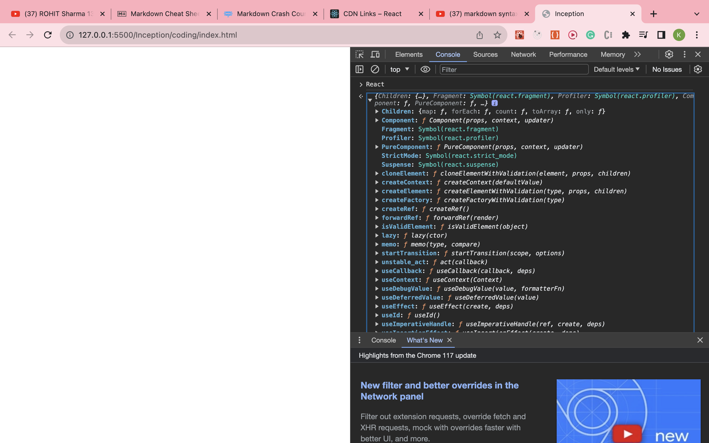

- First we normally write basic html 

- 


 - <mark>secand we write program with javascript</mark>

- 


- <mark>Third program of "hello world" using cdn link use of createElement()</mark>

  - first check react on developer console while only used of cdn link u see lots of methods and properties given by that cdn link
  - 

  - syntex of createElement(type, props, ...children)

  - creating hello world using react and output below

  

### other example of normal html how we write in react left side is react part and right part is html tag in dom(browser)


-  

- 

- ```
    <div id = "parent">
       <div id= "child">
         <h1> i am h1 tag </h1>

       </div>
    </div>     


   ```

-    


***How code work when we used below example using reactcode(app.js)***

<mark>replace code inside root code in index.html to app.js</mark>
 - ```
      <div id="root">
      <h1>hello i willl replace by app.js code</h1>
      </div>
    
    ```


<mark>No replace only middle will replace</mark>
- ```
      <div id="root">
      <h1>hello i am top of root</h1>
      <h1>hello i willl not replace by app.js code</h1>
      <h1>hello i am below of root</h1>
      </div>
    
    ```   

- remember always put script of app.js below cdn link(both) other it throw error  


- one error we found will using react for creating element if there child of parent are more we caught error