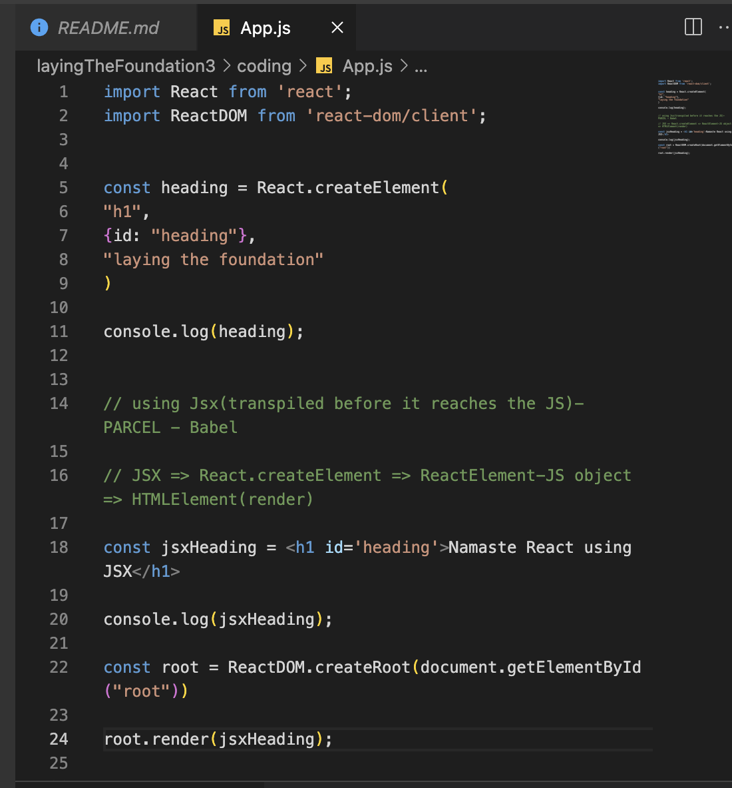
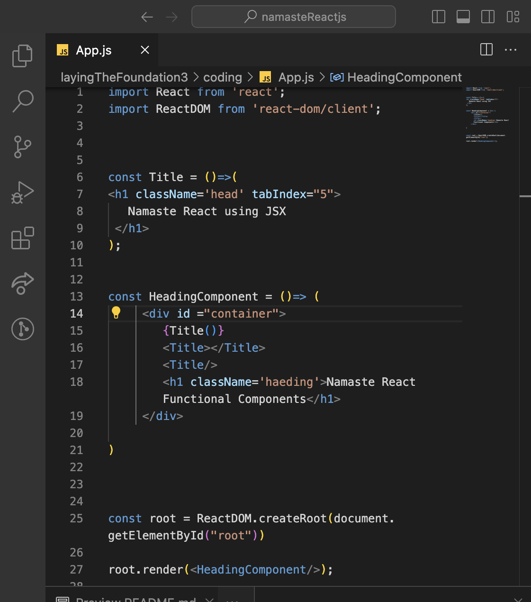

- what is JSX?
  *JSX is html-like markup inside a javascript file

  ```
  const heading = (
    <h1 id="title" key ="h1">
      Hello world
    </h1>  
  )
  ```
  - *JSX is mixer of html and javascript *
  - *JSX stands for JavaScript XML*

  *The Rules of JSX*

  1. return single root element(wrap multiple element from componet in single parent tag)

  ```
  <div> // wrap in parent
     <h1> i am child1</h1>
     
     <ul>
        ...
     </ul>
  </div>
  
       *OR*

   <> // wrap in parent
     <h1> i am child1</h1>
     
     <ul>
        ...
     </ul>
  </>
    This empty tag is called a Fragment. Fragments let you group things without leaving any trace in the browser HTML tree.
 
   ```


2.tags should be close

3.attribute should be camelCase like className =""

4.this how react element and jsx code look like




- Superpowers of JSX
 - *we can use javascript inside JSX*
 - * adv:- developer experience, syntatical sugar readability less code , maintainablity , no repeation*


- Role of type attribute in script tag? what options can i use there ?

  - text/javascript : It is the basic standard of writing javascript code inside the <script> tag.

     <script type="text/javascript"></script>

  - text/ecmascript : this value indicates that the script is following the EcmaScript standards.

  - module: This value tells the browser that the script is a module that can import or export other files or modules inside it.

  - text/babel : This value indicates that the script is a babel type and required bable to transpile it.

  - text/typescript: As the name suggest the script is written in TypeScript.


- {Title} vs
- {<Title/>} 
- {<Title><Title/>} in JSX?



here we using functional component inside other component and how we call three different way ex:- Title  in HeadingComponent